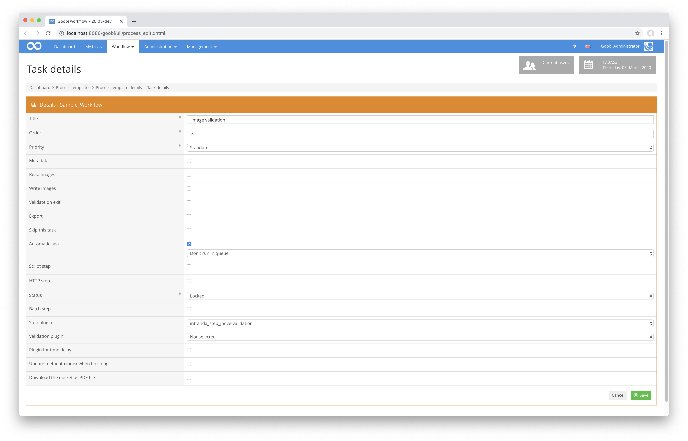

## Einführung
Diese Plugin dient zur Validierung von Bildern im Format `TIF` innerhalb von definierbaren Verzeichnissen. Die Validierung erfolgt dabei unter Zuhilfenahme der [Open-Source-Softwarebibliothek JHove ](https://jhove.openpreservation.org/) und ist weitreichend konfigurierbar.


## Installation
Zur Installation des Plugins muss zunächst die folgende Datei installiert werden:

```bash
/opt/digiverso/goobi/plugins/step/plugin_intranda_step_tif_validation-base.jar
```

Um zu konfigurieren, wie sich das Plugin verhalten soll, können verschiedene Werte in der Konfigurationsdatei angepasst werden. Die zentrale Konfigurationsdatei befindet sich üblicherweise hier:

```bash
/opt/digiverso/goobi/config/plugin_intranda_step_tif_validation.xml
```

Innerhalb diese Konfigurationsdatei ist unter anderem der Pfad zu der JHove-Konfiguration benannt. Im Falle des unten aufgeführten Beispiels ist dort der folgende Pfad angegeben:

```xml
<jhoveConfiguration>/opt/digiverso/goobi/config/jhove/jhove.conf</jhoveConfiguration>
```

Entsprechend müssen unter diesem Pfad daher auch folgende beiden Dateien installiert werden:

```xml
/opt/digiverso/goobi/config/jhove/jhove.conf
/opt/digiverso/goobi/config/jhove/jhoveConfig.xsd
```


## Überblick und Funktionsweise
Das Plugin wird üblicherweise vollautomatisch innerhalb des Workflows ausgeführt. Es ermittelt zunächst, ob sich innerhalb der Konfigurationsdatei ein Block befindet, der für den aktuellen Workflow bzgl. des Projektnamens und Arbeitsschrittes konfiguriert wurde. Wenn dies der Fall ist, werden die weiteren Parameter ausgewertet und die Checks gestartet. Ist einer der konfigurierten Checks nicht erfolgreich, so wird der konfigurierte oder alternativ der vorherige Arbeitsschritt in einen Fehlerstatus versetzt und die Validierungsmeldung in das Vorgangslog geschrieben. Sollen die Arbeitsschritte zwischen dem Validierungsschritt und dem benachrichtigten Schritt im Status auf `geschlossen` gesetzt werden, so sind diese für die Bearbeiter ebenfalls mit der Korrekturmeldung versehen und erlauben so eine Nachvollziehbarkeit des Problemfalls.

Dieses Plugin wird in den Workflow so integriert, dass es automatisch ausgeführt wird. Eine manuelle Interaktion mit dem Plugin ist nicht notwendig. Zur Verwendung innerhalb eines Arbeitsschrittes des Workflows sollte es wie im nachfolgenden Screenshot konfiguriert werden.




## Konfiguration
Die Konfiguration für das Plugin erfolgt innerhalb der zentralen Konfigurationsdatei. Sie sieht beispielhaft wie folgt aus:


{{CONFIG_CONTENT}}

{{CONFIG_DESCRIPTION_PROJECT_STEP}}

Die Parameter innerhalb der zentralen Konfigurationsdatei des Plugins haben folgende Bedeutungen:

Parameter         | Erläuterung
------------------|----------------------------------------
`folder` | Mit diesem Parameter können Verzeichnisse festgelegt werden, deren Inhalte validiert werden sollen. Dieser Parameter kann wiederholt vorkommen. Mögliche Werte hierfür sind z.B. `master`, `media` oder auch individuelle Ordner wie `photos` und `scans`.
`openStepOnError` | Dieser Parameter legt fest, welcher Arbeitsschritt des Workflows erneut geöffnet werden soll, wenn ein Fehler innerhalb der Validierung auftritt. Wird dieser Parameter nicht verwendet, so aktiviert das Plugin stattdessen einfach den vorherigen Arbeitsschritt des Validierungsschritts.
`lockAllStepsBetween` | Mit diesem Parameter wird festgelegt, ob die Arbeitsschritte des Workflows zwischen dem Validierungsschritt und demjenigen, der innerhalb des Parameters `openStepOnError` angegeben wurde, wieder auf auf den Status gesperrt gesetzt werden sollen, so dass diese Arbeitsschritte ein erneutes Mal durchlaufen (`true`) werden müssen. Wird der Wert hingegen auf `false` gesetzt, so wird der Status der dazwischen liegenden Schritte nicht verändert, so dass die Arbeitsschritte auch nicht noch einmal durchlaufen werden.
`jhoveConfiguration` | Mit diesem Parameter wird angegeben, wo sich die Konfigurationsdatei für JHove befindet.
`check` | Innerhalb eines jeden Elements check wird festgelegt, was JHove genau validieren soll. Hier wird beispielsweise festgelegt, welches Dateiformat erwartet wird. Für den erwarteten Wert kann innerhalb des Elements `<wanted>` eine direkte Eingabe auch als Bereich erfasst werden. Ebenso ist es hier auch möglich, eine Variable zu verwenden, die durch den Variablen-Replacer ersetzt wird (z.B. `{process.Resolution}`. Zugehörig ist hierbei ebenso, welche Fehlermeldung im Falle einer fehlerhaften Validierung ausgegeben werden soll. In der Fehlermeldung können folgende Variablen genutzt werden: `${wanted}` für den exakten Inhalt aus dem Feld `<wanted>`, `${expected}` für den aufgelösten erwarteten Wert, `${found}` für den gefundenen Wert und `${image}` für den Dateinamen. Das Feld `<wanted>` kann wiederholt und mit dem Unterlement `<condition>` versehen werden. Dann wird der Check nur ausgeführt, wenn die konfigurierte Bedingung zutrifft. 
