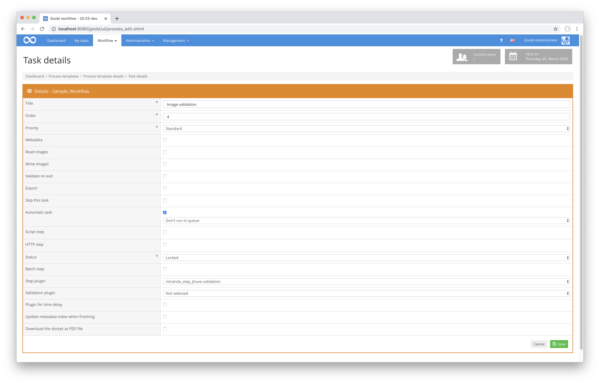

## Introduction
This plugin is used to validate images in `TIF` format within defined directories. The validation is done with the help of the [open source software library JHove](https://jhove.openpreservation.org/) and is extensively configurable.


## Installation
To install the plugin, the following file must be installed first:

```bash
/opt/digiverso/goobi/plugins/step/plugin_intranda_step_tif_validation-base.jar
```

To configure how the plugin should behave, different values can be adjusted in the configuration file. The central configuration file is usually located here:

```bash
/opt/digiverso/goobi/config/plugin_intranda_step_tif_validation.xml
```

Within this configuration file the path to the JHove configuration is named. In the case of the example below, the following path is given:

```xml
<jhoveConfiguration>/opt/digiverso/goobi/config/jhove/jhove.conf</jhoveConfiguration>
```

Accordingly, the following two files must also be installed under this path:

```xml
/opt/digiverso/goobi/config/jhove/jhove.conf
/opt/digiverso/goobi/config/jhove/jhoveConfig.xsd
```


## Overview and functionality
The plugin is usually executed fully automatically within the workflow. It first determines whether there is a block within the configuration file that has been configured for the current workflow with respect to project name and work step. If this is the case, the other parameters are evaluated and the checks are started. If one of the configured checks is not successful, the configured or alternatively the previous work step is set to an error status and the validation message is written to the process log. If the work steps between the validation step and the notified step are to be set in the status to closed, these steps are also provided with the correction message for the agents and thus allow the problem case to be traced.

This plugin is integrated into the workflow in such a way that it is executed automatically. Manual interaction with the plugin is not necessary. For use within a step of the workflow it should be configured as shown in the following screenshot.




## Configuration
The configuration for the plugin is done within the central configuration file. It looks like the following example:

```xml
<config_plugin>
    <config>
        <project>*</project>
        <step>*</step>
        <!-- folders to validate, can be multiple one (e.g. master, main etc. -->
        <folder>master</folder>
        <openStepOnError>Scanning</openStepOnError>
        <lockAllStepsBetween>true</lockAllStepsBetween>
        <jhoveConfiguration>/opt/digiverso/goobi/config/jhove/jhove.conf</jhoveConfiguration>
        <namespace uri="http://www.loc.gov/mix/v20" name="mix" />
        <namespace uri="http://hul.harvard.edu/ois/xml/ns/jhove" name="jhove" />
        <!--Counter check -->
        <check>
            <xpath>count(//jhove:repInfo/jhove:format)</xpath>
            <wanted>1.0</wanted>
            <error_message>Check for image format count: Image: "${image}" Wanted value: "${wanted}"\, found value: "${found}".</error_message>
        </check>
        <check>
            <xpath>string(//jhove:repInfo/jhove:format)</xpath>
            <wanted>TIFF</wanted>
            <error_message> Check for image format: Image: "${image}" Wanted value: "${wanted}"\, found value: "${found}".</error_message>
        </check>
        <!--Check if the image is well-formed and valid -->
        <check>
            <xpath>//jhove:repInfo/jhove:status</xpath>
            <wanted>Well-Formed and valid</wanted>
            <error_message> Check for image status: Image: "${image}" Wanted value: "${wanted}"\, found value: "${found}".</error_message>
        </check>
        <!--Check for resolution (number or range) -->
        <integrated_check name="resolution_check">
            <mix_uri>http://www.loc.gov/mix/v20</mix_uri>
            <wanted>100.0-899.23</wanted>
            <error_message> Check for resolution: Image: "${image}" Wanted value: "${wanted}"\, found value: "${found}".</error_message>
        </integrated_check>
    </config>
</config_plugin>
```

The parameters within the plugin's central configuration file have the following meanings:

| Wert | Beschreibung |
| :--- | :--- |
| `project` | This parameter determines for which project the current block `<config>` is to apply. The name of the project is used here. This parameter can occur several times per `<config>` block. |
| `step` | This parameter controls for which work steps the block &lt;config&gt; should apply. The name of the work step is used here. This parameter can occur several times per `<config>` block. |
| `folder` | This parameter can be used to specify directories whose contents are to be validated. This parameter can occur repeatedly. Possible values are `master`, `media` or individual folders like `photos` and `scans`. |
| `openStepOnError` | This parameter determines which step of the workflow should be reopened if an error occurs within the validation. If this parameter is not used, the plugin simply activates the previous step of the validation step instead. |
| `lockAllStepsBetween` | This parameter is used to determine whether the work steps of the workflow between the validation step and the one specified within the parameter openStepOnError are to be set back to the status locked so that these work steps have to be run through again (`true`). If, on the other hand, the value is set to `false`, the status of the steps in between is not changed, so that these steps are not run through again. |
| `jhoveConfiguration` | This parameter specifies where the configuration file for JHove is located. |
| `check` | Within each element check is defined what exactly JHove should validate. For example, here you define which file format is expected. Also included is which error message should be issued in case of an incorrect validation. |

